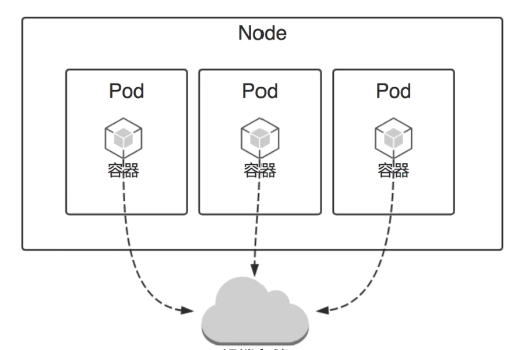
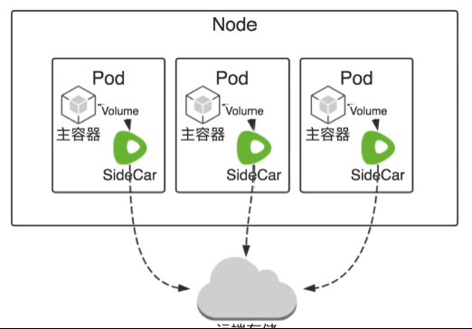
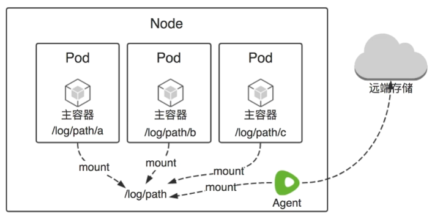
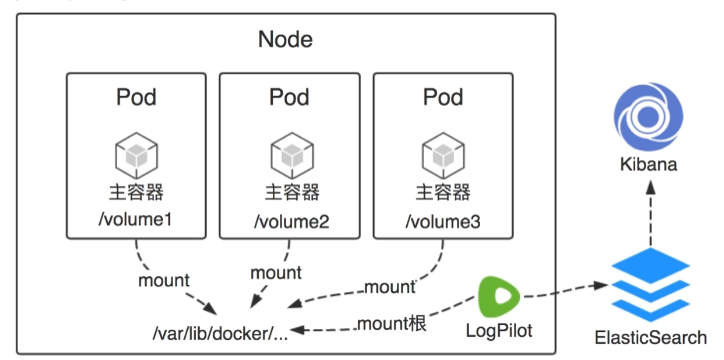

---
layout:		post
title:		"kubernetes 日志管理"
description:	""
date:		2021-02-15
author:		"Yawei"
categories: "kubernetes"
keywords:
    - k8s
    - kubernetes
    - log
---

# 日志管理特征及方案

k8s日志分为两块儿：
* stdout, stderr
  这部分是容器自身的日志输出，通常会存储在`/var/lib/docker/containers/[cname]/[cname]-json.log`中
* 服务日志文件
  默认会写在容器中，服务重启会丢失

## 如何解决丢失问题
* 远端存储
* Sidecar
* LogAgent

## 远端存储
直接为应用配置远端日志，如kafka, es等。

业内使用较多。

* 简单
* 对应用有侵染

## SideCar
为每一个Pod配置一个SideCar, SideCar与主容器共享Volume,然后由SideCar转发日志到远端。

这会对每一个Pod都有侵染，官方不建议使用。

## LogAgent
为每一个Node配置一个Agent, 通过一个Agent采集所有的日志。一般以DaemonSet方式运行。

需要为应用约定好日志路径。

## LogAgent方案实践

### [LogPilot](https://github.com/AliyunContainerService/log-pilot)
阿里开源日志采集工具，支持动态配置，对容器更加友好。本质上是对静态日志采集工具的包装，目前支持[Fluentd Plugin](https://github.com/AliyunContainerService/log-pilot/blob/master/docs/fluentd/docs.md)和[Filebeat Plugin](https://github.com/AliyunContainerService/log-pilot/blob/master/docs/filebeat/docs.md)
* 智能的容器日志采集工具
* 自动发现