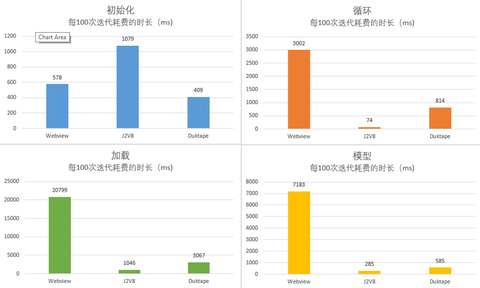

---
layout:		post
title:		"Android平台JS引擎对比"
description:	"V8, Webview, Duktape"
date:		2021-02-19
author:		"Yawei"
categories: "Android"
keywords:
    - JS Engine
    - J2V8
    - V8
    - Android
    - Webview
    - Duktape
---

公司准备推出一个具备类似微信小程序的Mobile平台类APP, 经过调研，小程序架构都是渲染层与逻辑层分离的（小程序技术单开文章进行分析），而逻辑层其实就是一个JS引擎，那么JS引擎的选择就显得至关重要。因此，特别对目前Android平台上比较流行的JS引擎做一个对比。

# 比较对象

* [js-evaluator-for-android](https://github.com/evgenyneu/js-evaluator-for-android): 对native android webview的封装
* [J2V8](https://github.com/eclipsesource/J2V8): 对Google V8引擎做的java封装
* [duktape-android](https://github.com/cashapp/duktape-android):基于Duktape JS引擎做的封装

# 测试条目

* 初始化：循环初始化创建各个JS引擎，比较初始化效率
* 循环：循环执行字符串比较，对比执行效率
* 加载：加载一个大小为174k的json文件，比较加载效率
* 模型：执行一个复杂的计算模型，对比执行效率

> 坑点：js-evaluator-for-android是懒加载，在初始化时没有做任何事情，只有当执行js时才会真正初始化webview，而这也会导致后续所有的测试都不准确。因此，在初始化测试时，需要手动调用`getWebViewWrapper`并计入初始化时间；在进行其他测试时，也都需要手动调用`getWebViewWrapper`之后再开始执行。 

完整测试代码在[Github](https://github.com/pfcstyle/jsperformance)

# 测试结果

# 对比总结

|         | 优点                                | 缺点                                                                   | 大小(默认全ABI) |
| ------- | ----------------------------------- | ---------------------------------------------------------------------- | --------------- |
| Webview | 没有依赖，不增加额外大小            | 效率低，不能执行大JS代码（大于1M）                                     | 0               |
| J2V8    | 效率最高，使用方便                  | 初始化较慢，对于apk大小增幅较大，目前仅有x64,x86,armv7和arm64v8类型ABI | 92M             |
| Duktape | 初始化快，体积小，具备全平台类型ABI | 运行较J2V8慢                                                           | 2.45M           |

