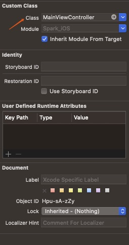
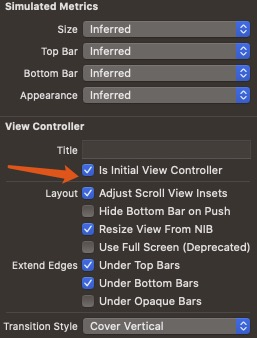

---
layout:		post
title:		"Re-Add storyboard"
description: ""
date:		2021-03-08
author:		"Yawei"
categories: [iOS, Swift]
keywords:
    - iOS
    - Swift
    - Storyboard
---

# Storyboard
1. AppDelegate可以什么逻辑都没有
2. SceneDelegate可以什么相关逻辑都没有
3. Info.plist

4. Storyboard设置

# Xib

1. Xib->File's Owner->右侧identify inspect->Class选项选择自己的ViewController
2. Xib->左侧根View->右侧Connection inspect->Referencing Outlets->连线到File's Owner
